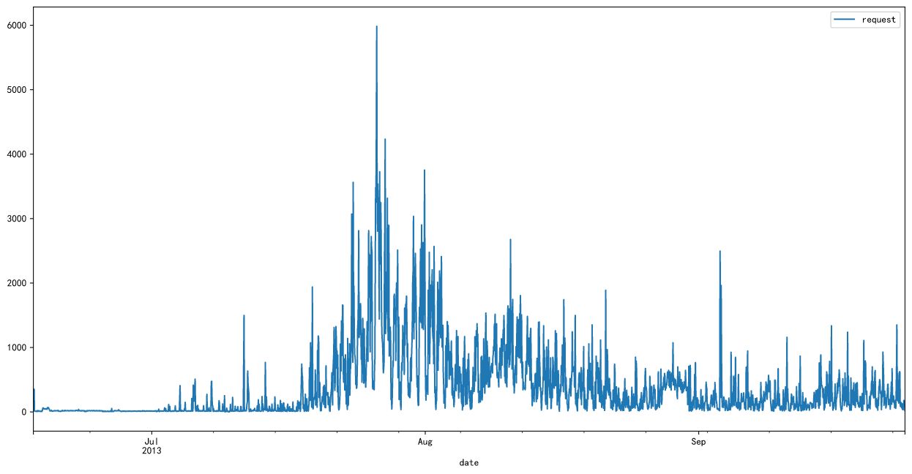
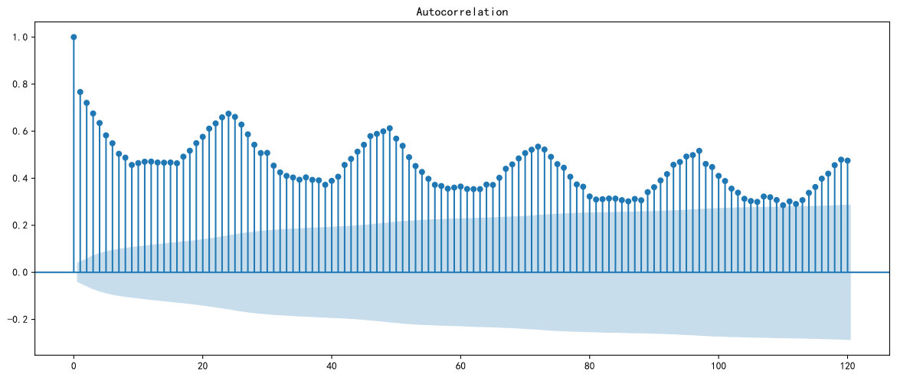
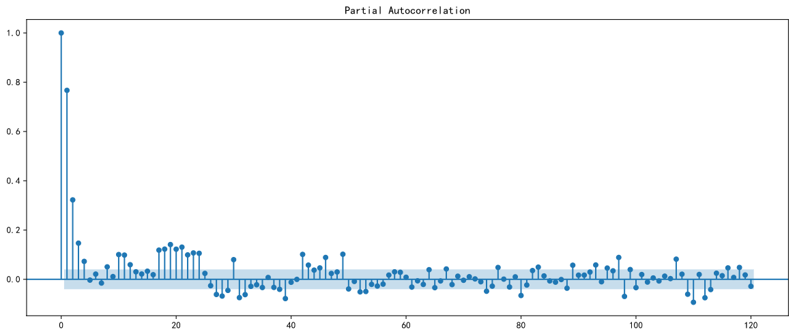
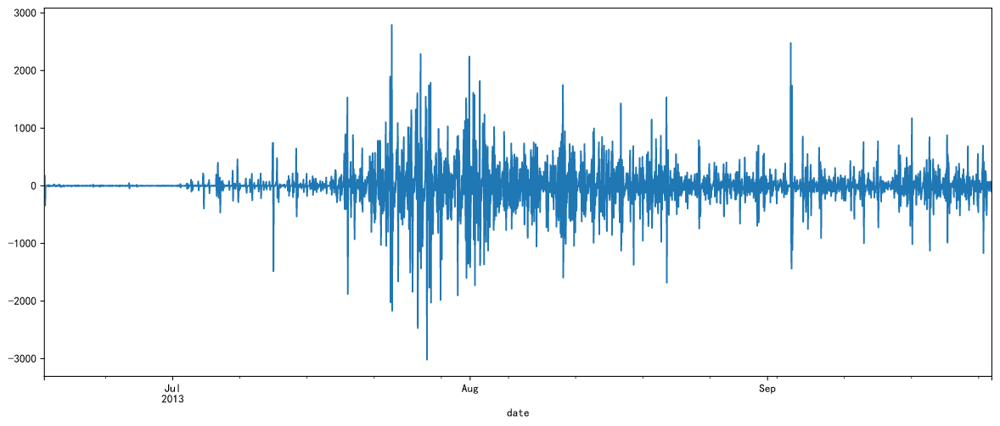
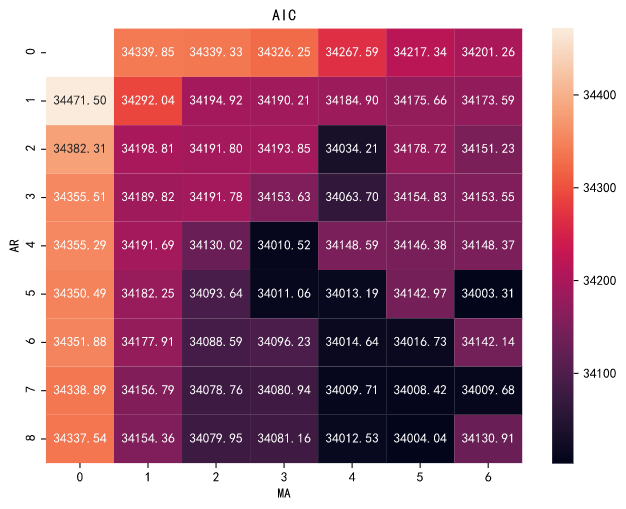
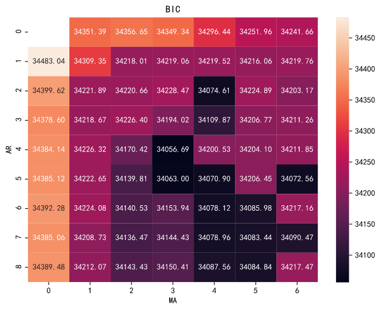
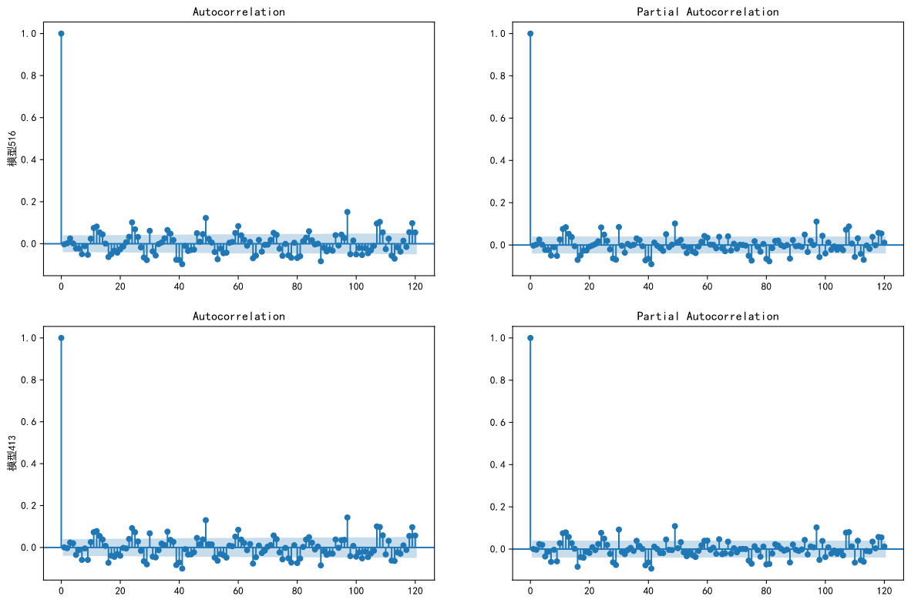
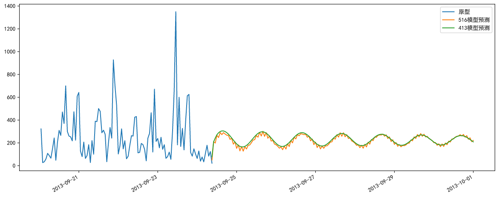

# 时间序列分析Nginx日志


服务器上，Nginx的日志很常见


网络服务日志分析，是常见的一种分析。可以根据之前的访问量，预估之后的访问量，然后根据访问量决定服务器是增加配置和带宽，还是减少。并且结合用户注册以及支付还可以分析用户转化率和支付率。


我们现在就用时间序列分析一下Nginx日志


# 数据采集


现在是2021年，以免纠纷，我找了一个以前的2013年现在已经废弃的网站来做示例


## 压缩包


服务器基本都有备份功能，会按时或者按照尺寸保存一个zip(gz、tar)作为备份


Python自带 **zipfile** 组件，我们可以直接加载，并且可以得到压缩包里面的内容


```py
from zipfile import ZipFile
z = ZipFile('./access.zip')
z.namelist()
```


这个压缩包里面只有一个access文件


```
['access.log']
```


## 读文件


我们使用 **pandas** 的 **read_table** 函数读取压缩包里的access数据


```py
import pandas as pd
df = pd.read_table('acces.log', sep=' ')
```


> **sep** 代表分隔符，日志是用的 **空格** ，根据情况有也可能是“,”或者“;”


## 设置头文件


打开Nginx配置，可以找到记录日志的部分


```conf
log_format  main  '$remote_addr - $remote_user [$time_local] "$request" '
                      '$status $body_bytes_sent "$http_referer" '
                      '"$http_user_agent" "$http_x_forwarded_for"';
```


总共我们统计了这些内容——


 key | value
----- | -----
remote_addr | 远程地址
remote_user | 用户
time_local | 服务器时间
request | 请求地址
status | 状态
body_bytes_sent | 页面尺寸
http_referer | 来源
http_user_agent | 设备
http_x_forwarded_for | 真实地址


> 其实我们可以做很多统计，比如按照用户设备分类，按照推广地址分类，按照ip地区分类……
> 这次我们只做总的访问统计。


我们根据配置设置一下头文件


> 注意 ```$remote_addr - $remote_user``` 之间有个“-”
> 注意 **time_local** 中 datetime和zone之间有空格，读取数据时候变成了两列


```py
import pandas as pd
from zipfile import ZipFile

names = ['remote_addr', '-', 'remote_user', 'time_local', 'time_zone', 'request', 'status', 'body_bytes_sent', 'http_referer', 'http_user_agent', 'http_x_forwarded_for' ] # 设置表头

z = ZipFile('./access.zip') # 加载压缩包
f = z.open(z.namelist()[0], 'r') # 读取压缩包中第一个文件
df = pd.read_table(f, sep=' ', header=None, names=names, encoding='unicode_escape') # 按照表头读取压缩包内文件
z.close() # 关闭压缩包
df = df.drop(columns=['-']) # 去掉多余的列
```


读取了log数据


```
remote_addr	remote_user	time_local	time_zone	request	status	body_bytes_sent	http_referer	http_user_agent	http_x_forwarded_for
0	60.165.14.57	-	[17/Jun/2013:14:50:18	+0800]	GET /forum.php?mod=forumdisplay&fid=2 HTTP/1.1	200	12941	http://www.moli2.com/forum.php	Mozilla/5.0 (compatible; MSIE 9.0; Windows NT ...	-
1	60.165.14.57	-	[17/Jun/2013:14:50:18	+0800]	GET /uc_server/avatar.php?uid=1&size=small HTT...	301	5	http://www.moli2.com/forum.php?mod=forumdispla...	Mozilla/5.0 (compatible; MSIE 9.0; Windows NT ...	-
2	60.165.14.57	-	[17/Jun/2013:14:50:18	+0800]	GET /home.php?mod=misc&ac=sendmail&rand=137145...	200	5	http://www.moli2.com/forum.php?mod=forumdispla...	Mozilla/5.0 (compatible; MSIE 9.0; Windows NT ...	-
3	60.165.14.57	-	[17/Jun/2013:14:50:20	+0800]	GET /forum.php?mod=viewthread&tid=3&extra=page...	200	21295	http://www.moli2.com/forum.php?mod=forumdispla...	Mozilla/5.0 (compatible; MSIE 9.0; Windows NT ...	-
4	60.165.14.57	-	[17/Jun/2013:14:50:20	+0800]	GET /uc_server/avatar.php?uid=1&size=middle HT...	301	5	http://www.moli2.com/forum.php?mod=viewthread&...	Mozilla/5.0 (compatible; MSIE 9.0; Windows NT ...	-
...	...	...	...	...	...	...	...	...	...	...
889069	5.10.83.68	-	[24/Sep/2013:09:33:32	+0800]	GET /forum.php?mod=viewthread&tid=286&extra= H...	200	24332	-	Mozilla/5.0 (compatible; AhrefsBot/5.0; +http:...	-
889070	180.153.160.116	-	[24/Sep/2013:09:34:04	+0800]	POST /api/manyou/my.php HTTP/1.0	200	152	http://www.moli2.com/api/manyou/my.php	Mozilla/5.0 (Windows; U; Windows NT 5.1; zh-CN...	-
889071	183.60.215.40	-	[24/Sep/2013:09:35:31	+0800]	GET /forum.php?mod=forumdisplay&fid=68&filter=...	200	29451	-	Mozilla/5.0 (compatible; EasouSpider; +http://...	-
889072	58.246.163.172	-	[24/Sep/2013:09:51:38	+0800]	POST /api/manyou/my.php HTTP/1.0	200	152	http://www.moli2.com/api/manyou/my.php	Mozilla/5.0 (Windows; U; Windows NT 5.1; zh-CN...	-
889073	203.208.60.60	-	[24/Sep/2013:09:54:10	+0800]	GET /forum.php?mod=viewthread&tid=295 HTTP/1.1	200	20453	-	Mozilla/5.0 (compatible; Googlebot/2.1; +http:...	-
889074 rows × 10 columns
```

## 日期处理


处理时间序列必须是正规的时间格式， **pandas** 里面有 **to_datetime** 专门转换成时间格式


Nginx的time_local有点奇怪date、time、zone格式都没问题，但是竟然date和time中间不是空格而是一个“:”，造成了这是一个非常规的时间格式，必须处理一下


- | 日期
--- | ---
原始 | [18/Mar/2018:20:05:08 +0800]
目标 | 18/Mar/2018 20:05:08 +0800


其实我们就是要把这个里面的冒号和外面的大括号去掉


我选择把date、time、zone都取出来，然后组合，因为觉得可能以后有别的用处，其实直接删除更简单


正则表达式


```
/^\[(\w+\/\w+/\w+):(\w+:\w+:\w+)\s(\+\w+)\]$/
```


操作表


```py
import re

pattern = re.compile(r'^\[(\w+\/\w+/\w+):(\w+:\w+:\w+)\s(\+\w+)\]$')

def to_datetime(s):
    """
    改成时间格式
    """
    res = pattern.match(s)
    return pd.to_datetime(res.group(1) + ' ' + res.group(2) + res.group(3))

df['date'] = df['time_local'] + ' ' + df['time_zone'] # 组合datetime和zone作为date
df['date'] = df['date'].apply(to_datetime) # 应用正则表达式改成to_datetime可识别的常规时间格式
```


date列的值已经是正常时间格式了


```
0        2013-06-17 14:50:18+08:00
1        2013-06-17 14:50:18+08:00
2        2013-06-17 14:50:18+08:00
3        2013-06-17 14:50:20+08:00
4        2013-06-17 14:50:20+08:00
                    ...           
889069   2013-09-24 09:33:32+08:00
889070   2013-09-24 09:34:04+08:00
889071   2013-09-24 09:35:31+08:00
889072   2013-09-24 09:51:38+08:00
889073   2013-09-24 09:54:10+08:00
Name: date, Length: 889074, dtype: datetime64[ns, pytz.FixedOffset(480)]
```


## 单位时常访问量


数据都是单条的，咱们要获取单位时常访问量，需要按照单位时常合并(这就是时间序列的好处，可以按照你需要的时间处理)


```py
combination = pd.Grouper(key='date', freq='1H') # 混合器，按照date列的1小时合并
count = df.groupby(combination).agg({'request': 'count'}) # 合并之后记录count(总量)
```


> freq参数具体可以看 https://pandas.pydata.org/pandas-docs/stable/user_guide/timeseries.html#offset-aliases


最终合并成了2372条数据


```
	request
date	
2013-06-17 14:00:00+08:00	94
2013-06-17 15:00:00+08:00	176
2013-06-17 16:00:00+08:00	352
2013-06-17 17:00:00+08:00	12
2013-06-17 18:00:00+08:00	15
...	...
2013-09-24 05:00:00+08:00	107
2013-09-24 06:00:00+08:00	179
2013-09-24 07:00:00+08:00	84
2013-09-24 08:00:00+08:00	124
2013-09-24 09:00:00+08:00	22
2372 rows × 1 columns
```


画图看看更直观


```py
import matplotlib.pyplot as plt
plt.rcParams['font.family'] = ['SimHei'] # 设置中文显示
plt.rcParams['axes.unicode_minus'] = False

count.plot(figsize=(16,8))
```





这个备份是6月份开始记录到了9月底


从图上看7月底有一波大涨，之后趋于平稳


应该是在7月有一波推广，到了9月份，几乎没啥变化了


# 时间序列分析


数据准备好了，可以开始时间序列分析了，我们的目的是预测之后的数据


## 自相关性(acf)


就是看数据是否平稳，不平稳要差分，具体解释看 [上篇文章](https://gitee.com/thales-ucas/postgrad)


```py
from statsmodels.graphics import tsaplots
fig, ax = plt.subplots(figsize=(15, 6))
tsaplots.plot_acf(count, lags=120, ax=ax) # 自相关性画图120阶
```





因为数据量比较大，所以我们做了120阶


但是确实不够平稳，只有110左右偶尔落入置信区间


## 偏自相关(pacf)


看看噪声，具体解释看 [上篇文章](https://gitee.com/thales-ucas/postgrad)


```py
fig, ax = plt.subplots(figsize=(15, 6))
tsaplots.plot_pacf(count, lags=120, ax=ax) # 偏自相关性画图120阶
```





说明确实有比较明显的噪声


## 单位根检验(Dickey-Fuller test)


函数 **statsmodels.tsa.stattools.adfuller** 可以获取


```py
from statsmodels.tsa import stattools
stattools.adfuller(count)
```


数据结果


```
(-2.3082325205728202,
 0.1693265656570936,
 27,
 2344,
 {'1%': -3.4331428650682807,
  '5%': -2.8627738368607076,
  '10%': -2.567426825246945},
 33608.80020143669)
 ```


我们还是可以使用 [之前的dickey方法](https://gitee.com/thales-ucas/postgrad) 做的更好看一点


```py
dickey(count)
```

我们可以获取表格


key | value
--|--
Test Statistic Value | -2.308233
p-value | 0.169327
Lags Used | 27
Number of Observations Used | 2344
Critical Value(1%) | -3.433143
Critical Value(5%) | -2.862774
Critical Value(10%) | -2.567427


1. 看P-value是否非常接近0
2. Test Statistic Value要小于Critical Value


本数据中，P-value 为 0.169327，不够接近0


adf结果为-2.308233， 大于三个level(1%、5%、10%)的统计值(-3.433143, -2.862774, -2.567427)


本数据不平稳！


## 差分(difference)


非平稳序列往往一次到两次差分之后，就会变成平稳序列。什么是差分呢？就是后一时间点的值减去当前时间点，也就是Δy~1~ = y~t+1~ - y~t~


pandas直接就包含差分函数 **diff**


```py
count['request'].diff()
```


我们看看差分之后的检验


```py
diff = count['request'].diff().dropna()
dickey(diff)
```


> **dropna** 方法是去掉非数字


key | value
-- | --
Test Statistic Value | -13.53278
p-value | 0.0
Lags Used | 27
Number of Observations Used | 2343
Critical Value(1%) | -3.433144
Critical Value(5%) | -2.862774
Critical Value(10%) | -2.567427


这次 **p-value** 接近0了，并且 **Test Statistic Value** 也远远小于 **Critical Value** 了


看看差分后的效果图


```py
diff.plot(figsize=(15, 6))
```





## 获取最佳order


### AIC:


赤池信息准则（AkaikeInformation Criterion，AIC）


在一般的情况下，AIC可以表示为： AIC=2k-2ln(L)


### BIC:


贝叶斯信息准则（Bayesian Information Criterion，BIC）


计算公式：BIC=-2 ln(L) +ln(n)*k
- L：似然函数
- n：样本大小
- K：参数数量
与AIC一样是对模型的拟合效果进行评价的一个指标，BIC值越小，则模型对数据的拟合越好。


因为数据比较大，我们ar最大值设为8，ma最大值设为6


```py
from statsmodels.tsa.stattools import arma_order_select_ic
orders = arma_order_select_ic(diff, ic=['aic', 'bic'], trend='nc', max_ar=8, max_ma=6)
```

会给出所有数据，并推荐最佳值


```
{'aic': …… ,
 'bic': …… ,
 'aic_min_order': (5, 6),
 'bic_min_order': (4, 3)}
```


其实我们可以把aic和bic用热力图表示一下，更直观








颜色最黑的就是最佳值


## 模型


有了最佳order，我们可以构建模型了


aic和bic的模型各创建一个


我们使用ARIMA模型，ARIMA模型和ARMA模型一样都是由p和q决定的


但是ARIMA多了一个d，就是差分的阶，我们做了一阶差分，那么d=1


```py
from statsmodels.tsa import arima_model
arima516 = arima_model.ARIMA(count, (5, 1, 6)).fit()
arima413 = arima_model.ARIMA(count, (4, 1, 3)).fit()
```


构建了模型，我们再看看自相关性


```py
resid = arima516.resid
fig, axes = plt.subplots(2, 2, figsize=(15,10))
axes[0, 0].set_ylabel('模型516')
fig = tsaplots.plot_acf(resid.values.squeeze(), lags=120, ax=axes[0, 0])
fig = tsaplots.plot_pacf(resid, lags=120, ax=axes[0, 1])
resid = arima413.resid
fig = plt.figure(figsize=(12,8))
axes[1, 0].set_ylabel('模型413')
fig = tsaplots.plot_acf(resid.values.squeeze(), lags=120, ax=axes[1, 0])
fig = tsaplots.plot_pacf(resid, lags=120, ax=axes[1, 1])
fig.show()
```





现在已经好多了


# 预测


模型创建好了，只要我们输入要预测的日期就可以预测了


```py
fig, ax = plt.subplots(figsize=(15, 6))
modeldf = pd.DataFrame({
    '516模型差分': arima516.predict('2013-09-24 09:00:00+08:00', '2013-10-1 00:00:00+08:00'),
    '413模型差分': arima413.predict('2013-09-24 09:00:00+08:00', '2013-10-1 00:00:00+08:00'),
})
modeldf['516模型预测'] = revert(modeldf['516模型差分'], count['request'][-1])
modeldf['413模型预测'] = revert(modeldf['413模型差分'], count['request'][-1])
ax.plot(count[count.index > '2013-09-20'], label='原型')
modeldf['516模型预测'].plot(ax=ax)
modeldf['413模型预测'].plot(ax=ax)
ax.legend()
```





aic的模型锯齿更明显一些，bic的模型更平滑一些


预测的是大的方向，按照数据来看，未来的访问量都是趋于平稳的，并不会有八月份的大波动，并且还有向下的趋势


也说明了大部分网站，可能都是这样的一个周期，上线有一波高涨，之后区域平稳，还有稍微的下降

